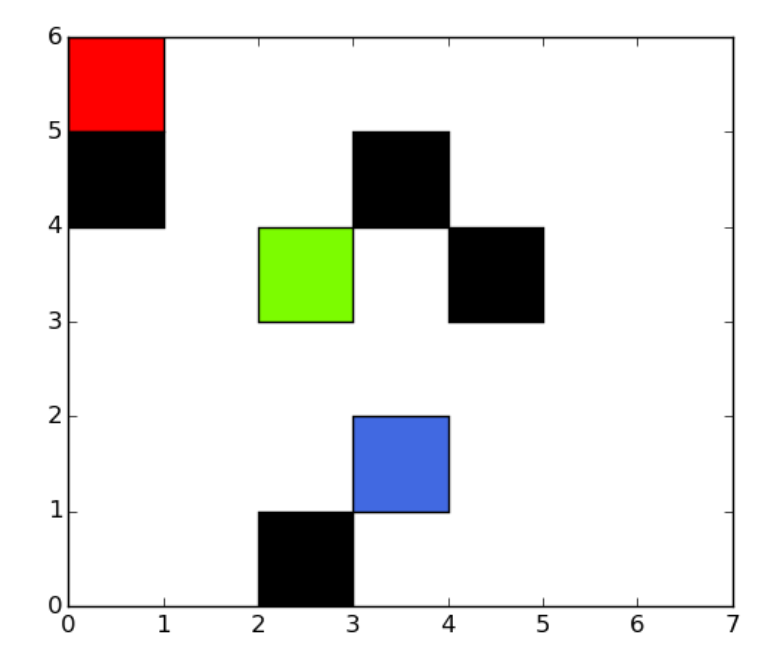
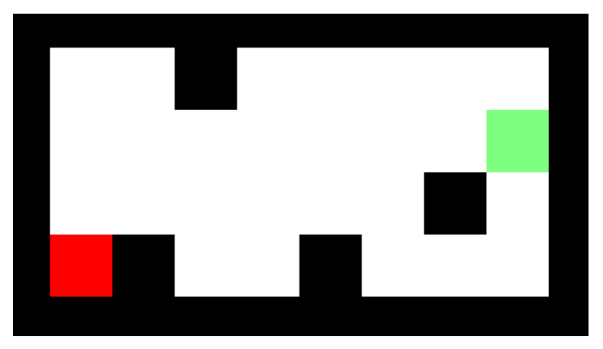
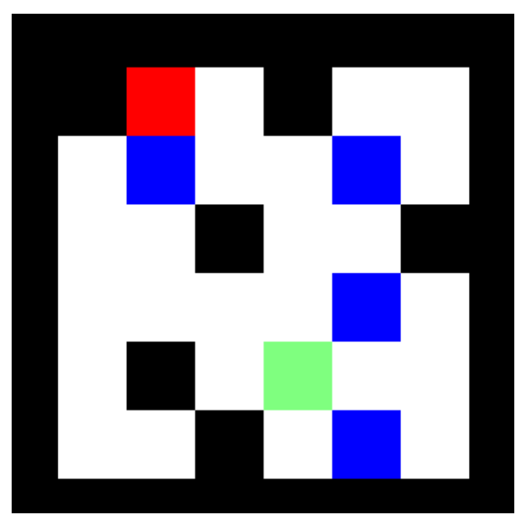

# Task Planning in "Sokoban on Ice"

> Rui Xiao xrui0310@gmail.com

This project is the fifth project assignment for COMP 550. The SAT-planner is implemented in `./Project5.cpp` file. The main function is in the `solve()`. For more analysis and description of approaches, please refer to **Project 5 Report.pdf**.

## Compiling

If you have installed the OpenCV 3.4, then you can simply compile the project by using `make` command in the root directory. The process of installing OpenCV on the given virtual machine would described later in this document. Considering the process of installing OpenCV is not an easy work, you could also comment the definition of `OPENCV` in `./src/Project5.cpp` and remove the including of OpenCV in `./Makefile` to disable the OpenCV. Then it should be able to be easily complied. The only difference is there would not be path images shown.

```c++
#define OPENCV
```

## Executing

After compiling the code, you could easily run the executable applications generated in the root directory like:

```bash
./Project5 ./scene1
```

Do not forget the scene file path.

## Problem Statement

Task planning focuses on planning the sequence of actions required to achieve a task. To solve a robotics problem using task planning, it is important to consider how to model the problem as a task planning problem, and use the appropriate technique for solving it.

Consider the following ”Sokoban on Ice” domain. A robot working in a grid world is tasked with reaching a target cell. Each cell may be empty, contain a static obstacle, or contain a movable box. The robot can move in any of the four cardinal directions. However, the floor is icy, so the robot will slip along the direction of motion until a static obstacle or the workspace boundary is hit (You may choose to model the boundary as static obstacles all-around). If the robot hits a movable box during its motion, the box gets pushed with the robot until the box hits another object (obstacle, another movable box, or workspace boundary).

An example domain is shown in on the right. The red block represent the robot, the green cell represent the goal, blue blocks represent movable boxes, and black blocks are obstacles. In this case, the robot could first move right, than down, then left, then up, to push the movable box upward. This will leave the movable box to the immediate right of the goal, and the robot right under the box. Then, the robot could move left, up, then right, to reach the green goal cell.



<center style="font-size:14px">Figure 1. Scene 1</center> 

In this project, you will model the ”Sokoban on Ice” do- main, and solve it by implementing a task planner. Make sure you are very clear on what are the state variables, what are the actions, and what are the preconditions and effects of the actions. Then, implement SAT-plan [1] to solve problems in your domain. Visualize your output to confirm the correctness of your implementation.

To implement SAT-plan, you may use the Z3 smt solver for SAT-solving https://github.com/Z3Prover/z3

### Protips

There is a trade-off between speed of generating the SAT instance and solving it. Using a naive encoding (e.g. using a proposition for each robot, each box, and each obstacle for each cell) could make it easy to encode, but make the SAT solver do more work. Using a smarter encoding (optimizing to reduce the number of variables, combining actions, removing propositions for obstacle cells) could make the generation of the SAT formula more difficult, but reduce the size of the SAT formula.

One trick to make encoding more efficient is to consider the boundary of the map as a rectangular frame of obstacles.

### References

[1] Kautz, Henry A., and Bart Selman. ”Planning as Satisfiability.” ECAI. Vol. 92. 1992. http://zones1v01. ing.unibo.it/Courses/AI/applicationsAI2009-2010/articoli/Planning as Satisfiability.pdf
 [2] LaValle, Steven M. Planning algorithms. Cambridge university press, 2006. http://planning.cs.uiuc.edu/ *Chapter 2 has a very good explanation of SAT-plan.*

### Deliverables

First implement a planner that can solve the ”Sokoban on Ice” problem with no movable boxes. This reduces to the ”Ice Path” problem from Pokemon. Use your planner to solve the ice path problem in figure 7. Then, expand your implementation to handle movable boxes. Use your planner to solve the problem in figure 6 and figure 8 provided in the accompanied zip file. Visualize your outputs to confirm that your solution is correct. Does your algorithm have any guarantees regarding the optimality of the solutions found? Investigate how the runtime of the algorithm is affected by the number of grid cells, as well as the depth of plan.



<center style="font-size:14px">Figure 2. Ice Cave</center> 



<center style="font-size:14px">Figure 3. Scene 2</center> 

### Bonus (5 pt)

Implement a search-based algorithm to solve your do- main by performing BFS or A* (if you can construct a good heuristic) on the possible actions in your domain. Compare the runtime and quality of solution between using the search-based algorithm and SAT-plan.

## How to Solve with SAT-plan

The process of having the SAT-planner to solve the task planning problem could be considered as the following steps:

1. Fetch and Process the Input Scene: We implemented this part in `InputBundle` helper class.
2. Initializing Propositions: We used a separate `Variable` class to store the generated propositions.
3. Generate Formula: Including conjunctions for the Initial State, Goal State, Operation Encodings, Frame Axioms and Complete exclusion axiom.
4. Find an Assignment using SAT-solver: This could be automatically done by calling `solver.check()`. Then the `solver.model()` indicates the solution path if one is found.

Planning for the problem without movable obstacles is easy. There are no vary situations that need to be considered as when to move the movable obstacles and at which direction to move the movable obstacles. It is not difficult to generate a formula constructed with a set of actions, goal, and horizon length such that the formula is satisfiable if and only if there is a plan with the given horizon. However, designing a planner for the version with movable obstacles is much more challenging.  

To consider the movable obstacles, the encoder would go through all the possible combinations of the positions of the movable obstacles. With each case, the operation encodings and frame axioms are properly set. It will consider the change of each cells after the movement of the robot. By this means, the propositions is defined to satisfy the rule of the game. Then the SAT solver just need to find the assignment for the formula which is supposed to be the solution path.

## Solution Example

The following solutions are produced by our implemented SAT-planner.

##### Ice Cave


<center style="font-size:14px">Figure 4. Ice Cave Solution</center> 

##### Scene 1


<center style="font-size:14px">Figure 5. Scene 1 Solution</center> 

##### Scene 2


<center style="font-size:14px">Figure 6. Scene 2 Solution</center> 

## Visualization of Solutions

To implement the solution visualization function, we included OpenCV 3.4 to help us. As you can see, we imported it in `./Project5.cpp`:

```c++
#include <opencv2/highgui.hpp>
#include <opencv2/opencv.hpp>
```

There is an example about how we used OpenCV to draw the obstacles:

```c++
// Create the path image using OpenCV
cv::Mat img = cv::Mat(VISUAL_CELL_SIZE * input->size.second, VISUAL_CELL_SIZE*input->size.first, CV_8UC3, cv::Scalar(255,255,255));
    cvNamedWindow("solution", CV_WINDOW_AUTOSIZE);

// Draw the obstacles
cv::rectangle(img, cvPoint(x*VISUAL_CELL_SIZE,image.size[0]-y*VISUAL_CELL_SIZE ),
                          cvPoint((x+1)*VISUAL_CELL_SIZE,image.size[0]-(y+1)*VISUAL_CELL_SIZE),
                          color, cv::FILLED, 0);

// Show the image in a window
IplImage tmp = cvIplImage(img);
cvShowImage("solution", static_cast<CvArr *>(&tmp));
std::cout<<"press any key to move"<<std::endl;
cvWaitKey(0);
```

The `./Makefile` has included the OpenCV libraries. To install the OpenCV 3.4 in your environment, you could refer to [OpenCV-Installation in Linux](docs.opencv.org/3.4.15/d7/d9f/tutorial_linux_install.html). In our experience of installing OpenCV in the virtual machine, we needed to set the environment variables in `/etc/bash.bashrc` and `/etc/ld.so.conf` as well.

To make sure the image could be shown as expected, you need to pay attention to the dependencies of OpenCV 3.4. In our experience, we used plenty of `apt-get install` commands to solve the dependence issues when installing the `libgtk2.0-dev`, which turned out to be essential to show the drawn image.


